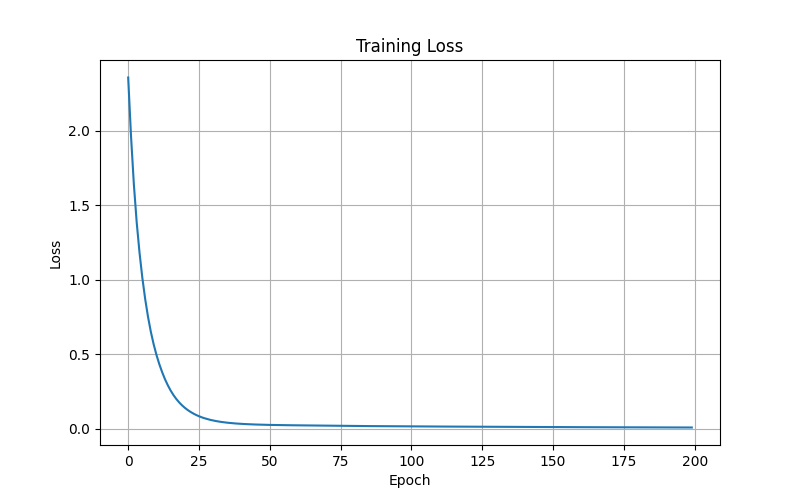

# NN from Scratch vs PyTorch

## 🚀 Overview

Reimplementation of a neural network from scratch using NumPy with full validation against PyTorch.

All components (forward, backward, gradients) were implemented manually and validated against PyTorch.

This project demonstrates a deep understanding of:
- forward pass
- backpropagation
- gradient computation
- training dynamics

---

## 🎯 Goal

The goal is to understand how neural networks work internally by building them from scratch and verifying correctness using PyTorch autograd.

---

## 🧠 Motivation

Modern frameworks like PyTorch abstract away most of the complexity of neural networks.

This project answers key questions:

- How are gradients computed?
- What exactly happens during backpropagation?
- Why does initialization matter?
- How do we verify correctness?

---

## ⚙️ Implementation

### NumPy model
- Linear layer
- ReLU activation
- MSE loss
- Manual backpropagation
- Gradient descent

### PyTorch model
- Equivalent architecture using nn.Module
- Autograd-based gradient computation

---

## 🔬 Experiments

### 1. Forward pass validation

We ensure that NumPy and PyTorch produce identical outputs:
**Difference** ≈ 1e-8


### 2. Gradient comparison

We compare manually computed gradients with PyTorch autograd:
Layer1 diff ≈ 1e-7
Layer2 diff ≈ 1e-7

This confirms correctness of backpropagation.

---

### 3. Numerical gradient checking

We validate gradients using finite differences:
Gradient diff ≈ 1e-7

---

### 4. Training dynamics

Loss decreases during training, confirming correct learning behavior.



---

## 📁 Project structure
├── numpy_nn/        # Neural network from scratch
├── torch_nn/        # PyTorch implementation
├── experiments/     # Experiments and validation
├── results/         # Saved plots
└── README.md

---
## 🚀 How to run

### Train NumPy model

```bash
python numpy_nn/main.py
```

### Compare forward
```bash
python -m experiments.compare_forward
```

### Compare gradients
```bash
python -m experiments.compare_backward
```

### Gradient check
```bash
python -m experiments.gradient_check
```

---
## 💡 Key insights

 • Backpropagation is chain rule applied layer by layer
 • Gradients must match both analytical and numerical estimates
 • Initialization strongly affects training dynamics
 • Deep learning frameworks are abstractions over simple math...

---
## 🧭 Conclusion

The NumPy implementation was validated against:

- PyTorch forward pass
- PyTorch autograd gradients
- Numerical gradient checking

All results match with negligible differences (≈ 1e-7), confirming that the implementation is mathematically correct.